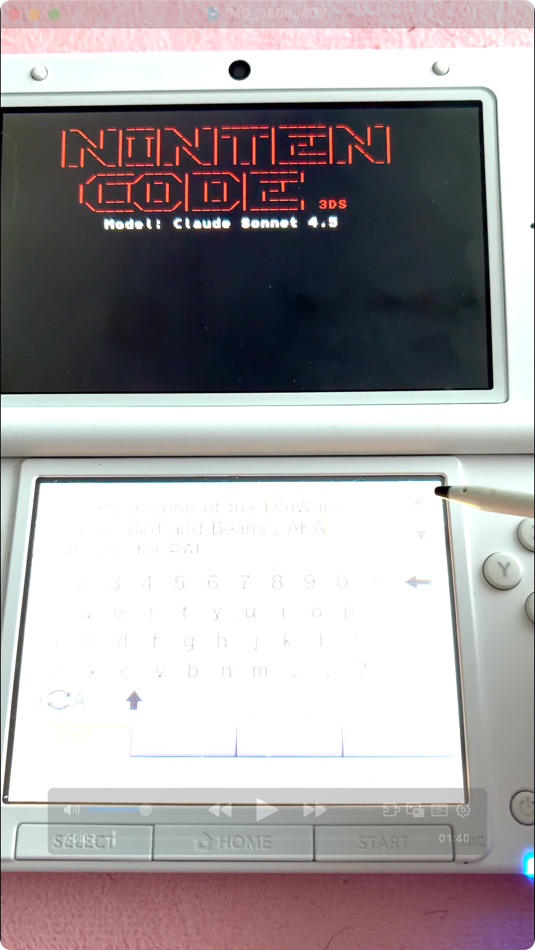
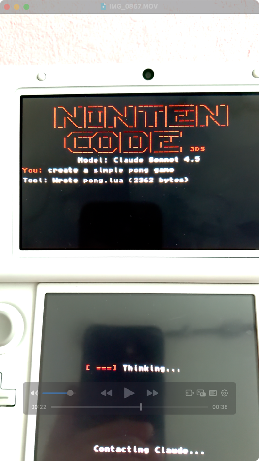
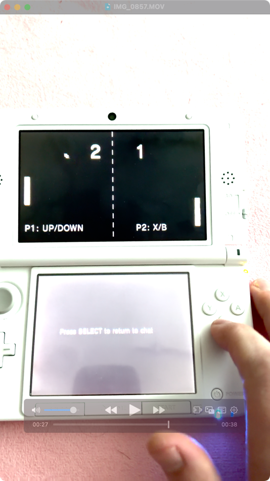

# Nintencode 3DS

An AI coding assistant for Nintendo 3DS powered by Claude. Ask it to make a game and it will write the Lua code and run it right on your 3DS.

## Demo

| **Ask for a game** | **Claude writes it** | **Play it on the 3DS** |
|---|---|---|
|  |  |  |

Type a prompt with the stylus -> Claude writes Lua code -> game launches at 60fps on the top screen. Press SELECT to return to chat.

## What is this?

Nintencode is a homebrew app that connects to the Anthropic Claude API directly from your 3DS. You type a prompt using the on-screen keyboard, Claude responds, and if you ask for a game, it writes the code and runs it immediately.

The cool part: Claude has access to a full Lua runtime with graphics primitives. So when you say "make pong", it writes a complete pong game in Lua and launches it. You play the game, press SELECT to exit, and you're back in the chat.

## Features

- Chat interface with Claude on your 3DS
- Claude can read/write files on your SD card
- Full Lua runtime with 2D graphics (via citro2d)
- Games run at 60fps on the top screen
- All files sandboxed to `sdmc:/nintencode/workdir/`

## Building

You'll need devkitPro with the 3DS toolchain:

```bash
# Install devkitPro, then:
source /etc/profile.d/devkit-env.sh

# Add your API key to include/app_config.h first!
make clean && make
```

Output: `Nintencode.3dsx`

## Setup

1. Get an Anthropic API key from https://console.anthropic.com/
2. Edit `include/app_config.h` and replace `YOUR_API_KEY_HERE` with your key
3. Build the project
4. Copy `Nintencode.3dsx` to your 3DS SD card (in `/3ds/` folder)
5. Launch from Homebrew Launcher

## Usage

- **A** - Open keyboard and type your prompt
- **START** - Exit the app
- **SELECT** (in game) - Exit game and return to chat

Try prompts like:
- "make a simple pong game"
- "create snake"
- "make a bouncing ball demo"

## Lua API

Games you ask Claude to create will use this API:

```lua
-- Graphics
clear(0x000000)                     -- Clear screen (hex color)
rect(x, y, w, h, 0xFFFFFF)          -- Draw rectangle
circle(x, y, radius, 0xFF0000)      -- Draw circle
line(x1, y1, x2, y2, thick, color)  -- Draw line
text(x, y, "hello", 0.5, 0xFFFFFF)  -- Draw text (scale 0.5-2.0)

-- Input
key_held("up")     -- Returns true if button held
key_down("a")      -- Returns true if just pressed
-- Buttons: a, b, x, y, l, r, up, down, left, right, start, select

-- Helpers
screen_width()   -- 400
screen_height()  -- 240
random(1, 100)   -- Random int in range
quit()           -- Exit game
```

Games must define `update()` and/or `draw()` functions.

## Technical Details

The 3DS can't run console text and 2D graphics at the same time, so the app switches between modes:
- Chat mode uses `PrintConsole`
- Game mode uses citro2d (hardware accelerated)

Networking uses libcurl with mbedTLS for HTTPS directly to the Anthropic API.

## Debug Proxy

For development, there's a Node.js proxy that logs all traffic:

```bash
cd proxy
node debug-proxy.js
```

Set `NINTENCODE_USE_PROXY 1` in app_config.h and point it to your computer's IP.

## Files

- `source/main.c` - Chat loop and API handling
- `source/ui.c` - Console UI rendering
- `source/net.c` - HTTP/HTTPS networking
- `source/tools.c` - File operations for Claude
- `source/lua_runtime.c` - Lua interpreter and graphics
- `source/json.c` - JSON parsing (JSMN-based)

## Known Limitations

- Long conversations can hit message history limits
- The tool_use/tool_result pairing needs work for complex multi-tool responses
- No streaming (waits for full response)

## License

MIT
